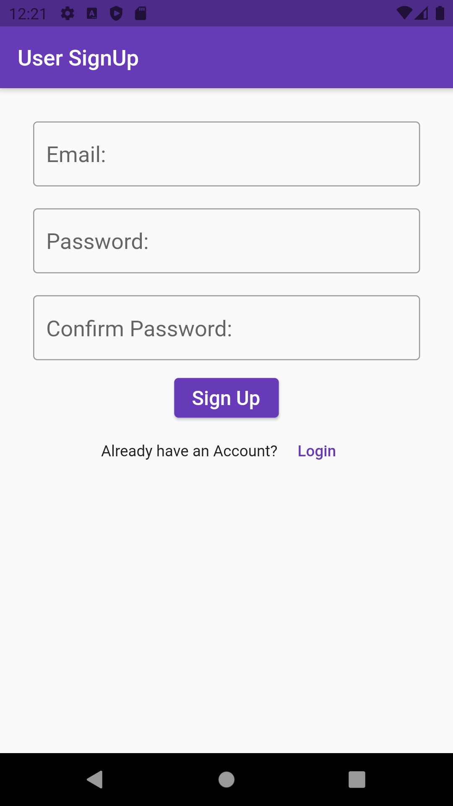
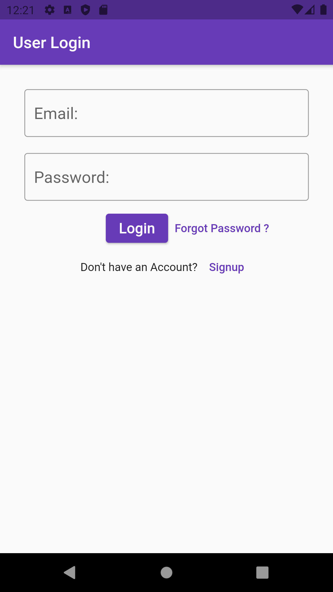
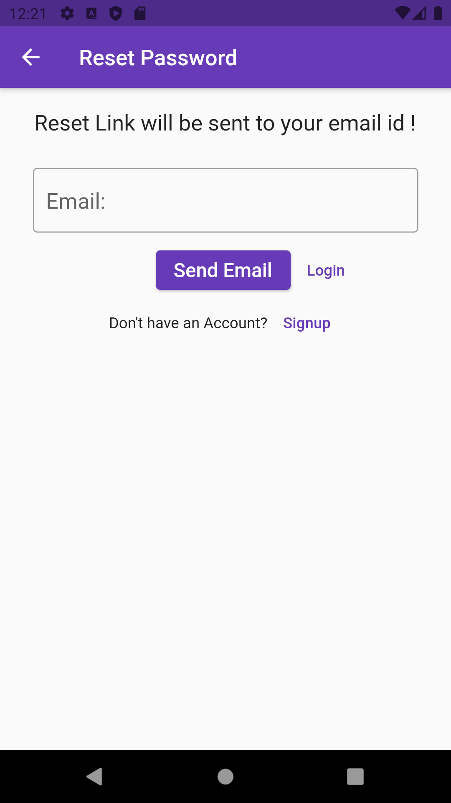
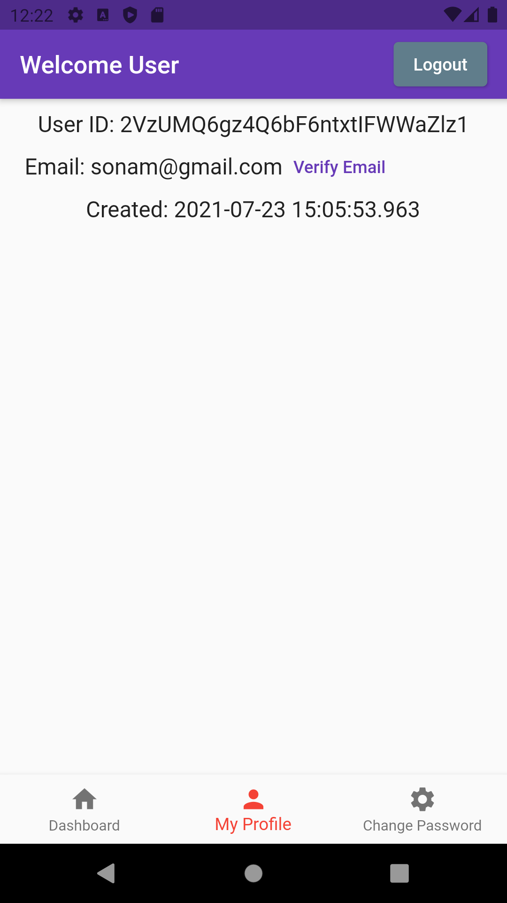
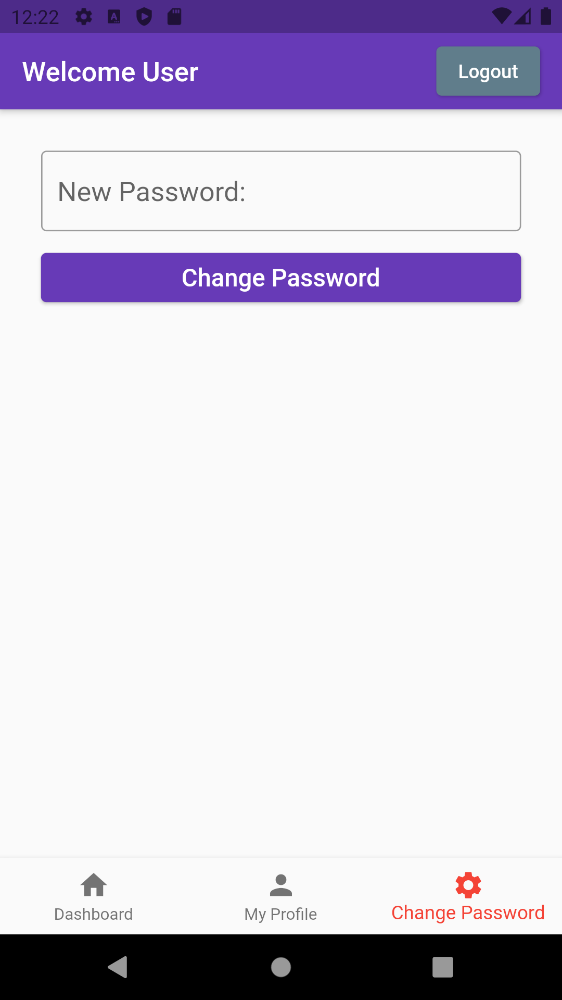
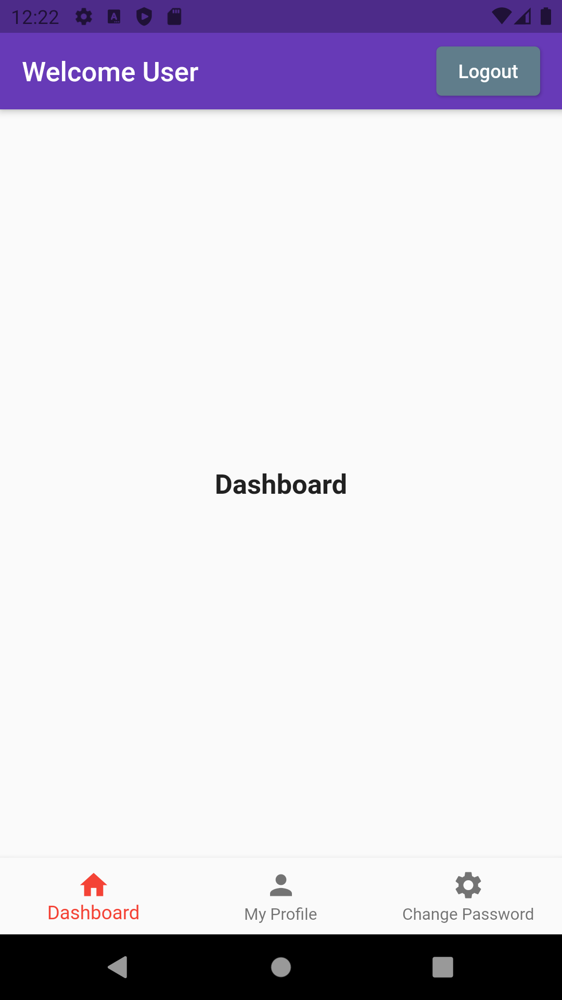

# Authenticator Flutter Firebase Authentication App

Welcome to the Flutter Firebase Authentication App repository! This project showcases a Flutter app integrated with Firebase for user authentication. Whether you're a seasoned developer or just getting started with app development, this project is designed to help you understand how to implement user authentication with Firebase in your Flutter apps.

## Features

- **User Registration**: Allow users to create an account using their email and password.
- **User Login**: Enable users to log in with their registered credentials.
- **Password Reset**: Implement a password reset functionality for users who forget their passwords.
- **User Profile**: Allow users to update their profile information, including name and profile picture.
- **Email Verification**: Send email verification links to ensure users' email addresses are valid.
- **User Authentication State**: Manage user authentication state, providing a seamless user experience.

## Screenshots

Here are some screenshots of the Flutter Firebase Authentication App in action:

<p align="center">
  <table>
    <tr>
      <td style="padding-right: 20">
        
      </td>
      <td>
        
      </td>
    </tr>
  </table>
</p>

<p align="center">
  <table>
    <tr>
      <td style="padding-right: 20">
        
      </td>
      <td>
        
      </td>
    </tr>
  </table>
</p>

<p align="center">
  <table>
    <tr>
      <td style="padding-right: 20">
        
      </td>
      <td>
        
      </td>
    </tr>
  </table>
</p>

## Getting Started

To get started with the Flutter Firebase Authentication App, follow these steps:

1. Clone this repository to your local machine.

   ```shell
   git clone https://github.com/your-username/flutter-firebase-auth-app.git
   ```

2. Navigate to the project directory.

   ```shell
   cd flutter-firebase-auth-app
   ```

3. Create a new Firebase project on the [Firebase Console](https://console.firebase.google.com/). Add your Android and iOS apps to the project and configure the Firebase SDK by adding the configuration files (`google-services.json` for Android and `GoogleService-Info.plist` for iOS) to the app.

4. Enable Email/Password authentication in the Firebase Console.

5. Run the app on a connected device or emulator.

   ```shell
   flutter run
   ```

6. Start testing the app's authentication features.

## Contributing

Contributions to the Flutter Firebase Authentication App are welcome and encouraged! If you find any bugs, have feature requests, or want to contribute in any other way, please open an issue or submit a pull request. Your contributions are highly appreciated.

## License

This project is licensed under the [MIT License](LICENSE). Feel free to use and modify the code to suit your needs.

## Acknowledgments

A big thank you to the Flutter and Firebase communities for their continuous support and the developers of the libraries and packages used in this app.

If you have any questions or need further assistance, please feel free to contact me.

Let's create secure and user-friendly authentication solutions with Flutter and Firebase!
